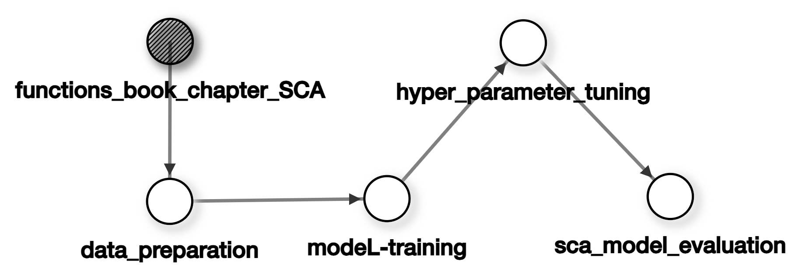

# ML-based High Resolution Snow Cover Mapping

Geoweaver workflow for high resolution snow cover area mapping task. The input data includes satellite imagery from Planet Cubesat. 

For more details, please refer to Geo-SMART Jupyter Book: https://geo-smart.github.io/scm_geosmart_use_case/chapters/one.html

## Workflow Graph

